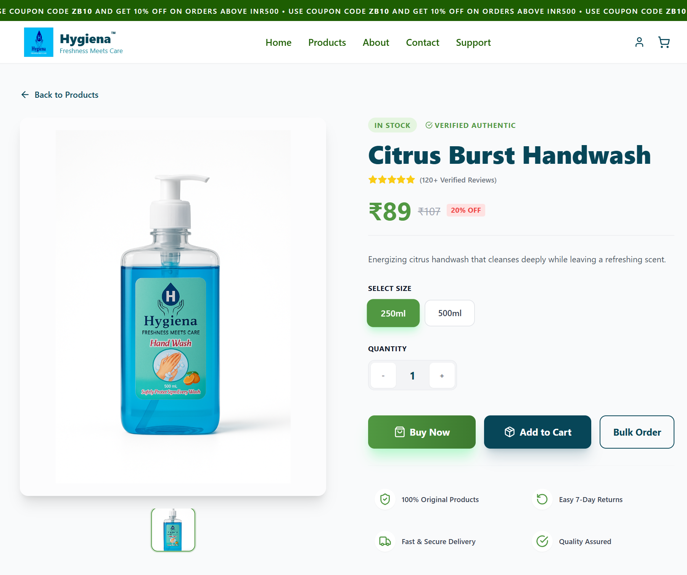
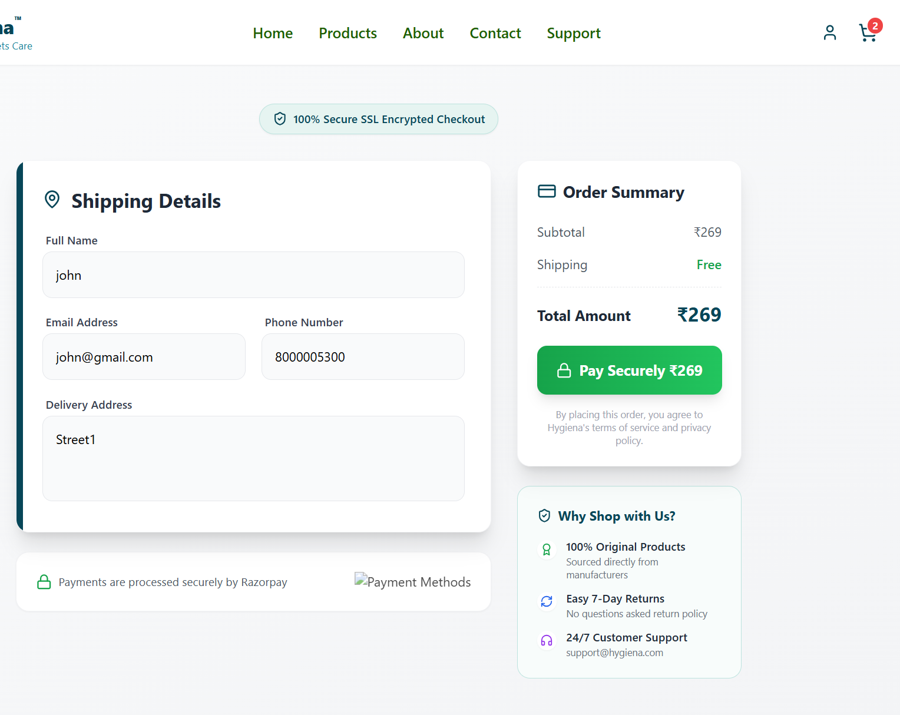
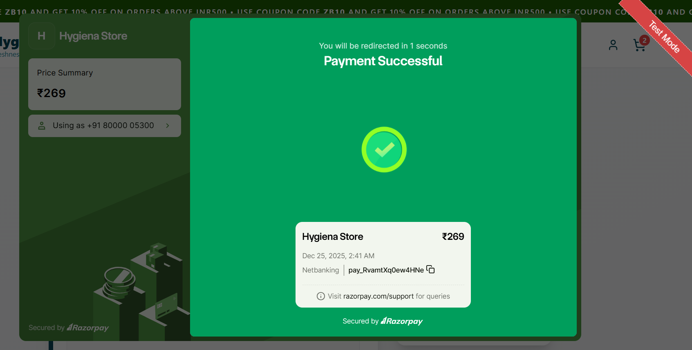
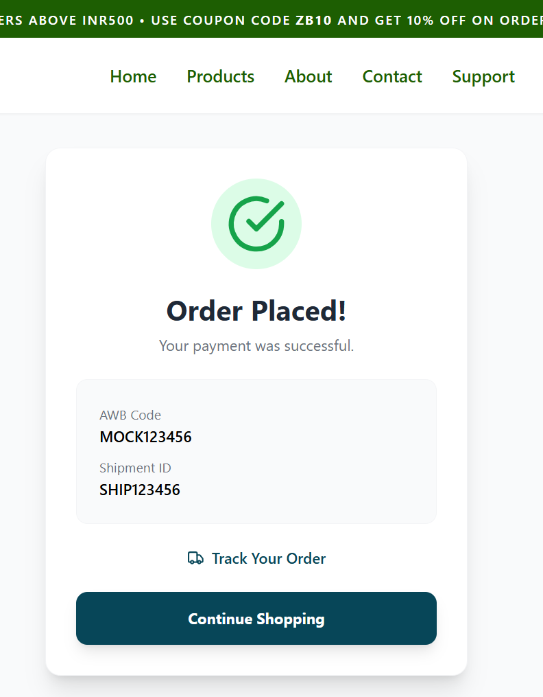
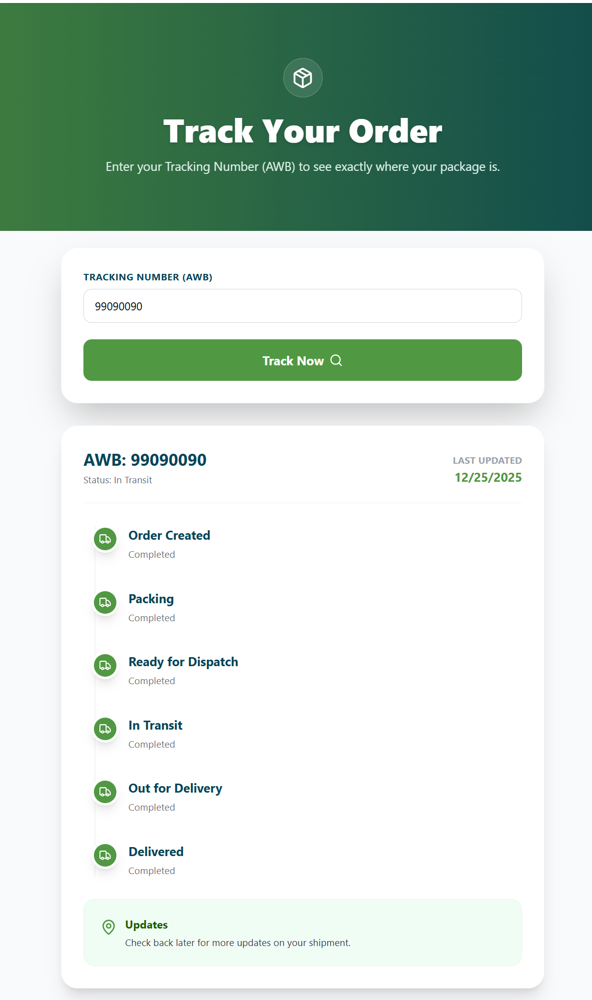

# E-Commerce Web Platform

A full-stack e-commerce web application that enables users to browse products,
manage a shopping cart, complete secure payments using Razorpay, and track
orders through a delivery lifecycle. The platform is designed with real-world
e-commerce flows and backend-ready architecture.

---

## 🛍 Features

- Product listing with categories and search
- Product detail pages with size and quantity selection
- Shopping cart with dynamic price calculation
- Coupon code and GST calculation
- Secure checkout using Razorpay (test mode)
- Order placed and payment success flow
- Order tracking using AWB / tracking ID
- Responsive design for mobile, tablet, and desktop

---

## 💳 Payment Integration

- Integrated **Razorpay** payment gateway in test mode
- Supports card, netbanking, wallet, and UPI payment flows
- Payment verification handled on the backend
- Test mode enabled via environment configuration

---

## 🚚 Order Tracking System

- Shipment tracking implemented using a mock Shiprocket service
- AWB numbers generated for each order
- Order lifecycle includes:
  - Order Created
  - Packing
  - In Transit
  - Out for Delivery
  - Delivered
- Designed to be easily replaceable with a real logistics API

---

## 🛠 Tech Stack

**Frontend**
- React
- Tailwind CSS
- Vite

**Backend**
- Node.js
- Express.js
- Razorpay SDK
- Mock Shiprocket service

**Tools**
- Git & GitHub
- dotenv for environment variables

---

## 📸 Screenshots
### Home Page


### Product Listing


### Product Details


### Cart & Checkout


### Razorpay Payment


### Order Placed


### Order Tracking


---
## 🌐 Live Demo
🔗 https://your-live-link.vercel.app  
*(Replace with your deployed URL)*

## ▶️ Run Locally

```bash
git clone https://github.com/ady254/ecommerce-web-platform.git
cd ecommerce-web-platform
npm install
npm run dev
